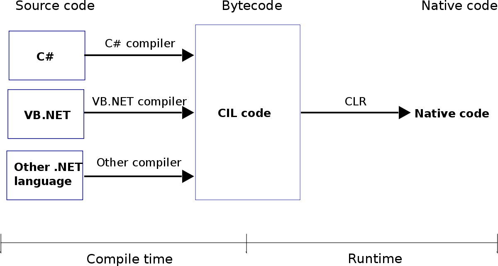

# Introdução

Introdução à linguagem de programação C#

## C# - O que é isso

C# (C-Sharp) é uma linguagem de programação orientada a objetos de uso geral lançada em 2002 pela Microsoft.

## Características

### Linguagem que pertence ao framework .NET

O framework .NET possui suporte à algumas linguagens de progração:

* C#

```csharp
var names = new List<String>
{
    "Ana",
    "Felipe",
    "Emillia"
};

foreach (var name in names)
{
    Console.WriteLine($"Hello {name}");
}
```

* VB

```VB
Dim names As New List(Of String)({
    "Ana",
    "Felipe",
    "Emillia"
})

For Each name In names
    Console.WriteLine($"Hello {name}")
Next
```

* F#

```csharp
 let names = [ "Ana"; "Felipe"; "Emillia"]

names
|> List.iter (fun name -> printfn "Hello %s" name)
```

### Fortemente tipada

Existem dois tipos de dados [Referência](https://docs.microsoft.com/pt-br/dotnet/csharp/tour-of-csharp/types-and-variables):

> #### Valor
> Contém diretamente os dados
> * *Tipos simples*
>   * **Integral com sinal**: `sbyte`, `short`, `int`, `long`
>   * **Integral sem sinal**: `byte`, `ushort`, `uint`, `ulong`
>   * **Caracteres Unicode**: `char`
>   * **Ponto flutuante IEEE**: `float`, `double`
>   * **Decimal de alta precisão**: `decimal`
>   * **Booliano**: `bool`
> * *Tipos enum*
>   * **Tipos definidos pelo usuário do formulário** `enum E {...}`
> * *Tipos struct*
>   * **Tipos definidos pelo usuário do formulário** `struct S {...}`
> * *Tipos de valor anuláveis*
>   * **Extensões de todos os outros tipos de valor com um valor** `null`
>
> #### Referência
> Armazena uma referência a seus dados
> * *Tipos de classe*
>   * **Classe base definitiva de todos os outros tipos**: `object`
>   * **Cadeia de caracteres Unicode**: `string`
>   * **Tipos definidos pelo usuário do formulário**: `class C {...}`
> * *Tipos de interface*
> * **Tipos definidos pelo usuário do formulário**: `interface I {...}`
> * *Tipos de matriz*
> * **Unidimensional e multidimensional**: `int[]` e `int[,]`
> * *Tipos delegados*
> * **Tipos definidos pelo usuário do formulário**: `delegate int D(...)`

### Compilada

> Transforma o código fonte, legível para humanos, em código de máquina

---



---

## Criando uma aplicação C'#'

Para criar uma aplicação C# utilizamos o seguinte comando:

[Referência new](https://docs.microsoft.com/pt-br/dotnet/core/tools/dotnet-new?tabs=netcore2x)

```bash
mkdir AppCSharp
cd AppCSharp
dotnet new console
```

Saída

```bash
The template "Console Application" was created successfully.

Processing post-creation actions...
echo Em versões iniciais do .NET Core era necessário executar o comando `dotnet restore`
echo Hoje ao criar o projeto já é executado, porém existem momentos que é necessário executar o comando
echo Esse comando serve para restaurar pacotes de dependências adicionados ao projeto
Running 'dotnet restore' on /mnt/c/Users/Matheus/Documents/Source/Repos/git/curso-c-sharp/Nível 1/source/AppCSharp/AppCSharp.csproj...
  Restoring packages for /mnt/c/Users/Matheus/Documents/Source/Repos/git/curso-c-sharp/Nível 1/source/AppCSharp/AppCSharp.csproj...
  Generating MSBuild file /mnt/c/Users/Matheus/Documents/Source/Repos/git/curso-c-sharp/Nível 1/source/AppCSharp/obj/AppCSharp.csproj.nuget.g.props.
  Generating MSBuild file /mnt/c/Users/Matheus/Documents/Source/Repos/git/curso-c-sharp/Nível 1/source/AppCSharp/obj/AppCSharp.csproj.nuget.g.targets.
  Restore completed in 849.25 ms for /mnt/c/Users/Matheus/Documents/Source/Repos/git/curso-c-sharp/Nível 1/source/AppCSharp/AppCSharp.csproj.


Restore succeeded.
```

Isso irá criar dois arquivos `Program.cs` e `AppCSharp.csproj`.

No arquivo `Program.cs` fica a porta de entrada de todas as aplicações utilizadas pelo .NET


> Padrões
> Classes, namespaces e métodos em C# seguem o padrão [PascalCase](https://docs.microsoft.com/pt-br/dotnet/standard/design-guidelines/capitalization-conventions)

```csharp
using System;

namespace AppCSharp
{
    // Classes nos ajudam a separar o código em objetos
    class Program
    {
        // Métodos contém código executável dos objetos
        // Ao iniciar a execução o método Main é chamado
        static void Main(string[] args)
        {
            // Linha de código executável
            Console.WriteLine("Hello World!");
        }
    }
}
```

Para executar a aplicação podemos utilizar o comando `dotnet run`

```bash
dotnet run
```

Saída

```bash
Hello World!
```

Vamos agora melhorar nosso programa dando a habilidade de ler uma informação passada pelo usuário.

Utilizaremos a concatenação de strings para para exibir a mensagem `Você disse: <mensagem do usuário>`

Para ler as informaçoes podemos utilizar a o método `Console.ReadLine`, que retorna uma string.

```csharp
using System;

namespace AppCSharp
{
    class Program
    {
        static void Main(string[] args)
        {
            Console.WriteLine("Digite uma mensagem");
            Console.WriteLine("Você disse: " + Console.ReadLine());
        }
    }
}
```

Ao excutarmos a aplicação temos:

```bash
dotnet run
```

Saída

```bash
Digite uma mensagem
```

Digite a sua mensagem

```bash
olá mundo
```

Saída

```bash
Você disse: olá mundo
```

---

## Recapitulando

Podemos utilizar comandos cli do .NET para criar, compilar e rodar aplicações

Cria uma aplicação

```bash
dotnet new console
The template "Console Application" was created successfully.

Processing post-creation actions...
echo Em versões iniciais do .NET Core era necessário executar o comando `dotnet restore`
echo Hoje ao criar o projeto já é executado, porém existem momentos que é necessário executar o comando
echo Esse comando serve para restaurar pacotes de dependências adicionados ao projeto
Running 'dotnet restore' on /mnt/c/Users/Matheus/Documents/Source/Repos/git/curso-c-sharp/Nível 1/source/AppCSharp/AppCSharp.csproj...
  Restoring packages for /mnt/c/Users/Matheus/Documents/Source/Repos/git/curso-c-sharp/Nível 1/source/AppCSharp/AppCSharp.csproj...
  Generating MSBuild file /mnt/c/Users/Matheus/Documents/Source/Repos/git/curso-c-sharp/Nível 1/source/AppCSharp/obj/AppCSharp.csproj.nuget.g.props.
  Generating MSBuild file /mnt/c/Users/Matheus/Documents/Source/Repos/git/curso-c-sharp/Nível 1/source/AppCSharp/obj/AppCSharp.csproj.nuget.g.targets.
  Restore completed in 849.25 ms for /mnt/c/Users/Matheus/Documents/Source/Repos/git/curso-c-sharp/Nível 1/source/AppCSharp/AppCSharp.csproj.


Restore succeeded.
```
Executa a aplicação

```bash
dotnet run
Digite uma mensagem
Olá Mundo
Você disse Olá Mundo
```

[Página Inicial](/curso-c-sharp-alunos/)

[Nível 2](/curso-c-sharp-alunos/nivel-2/)
